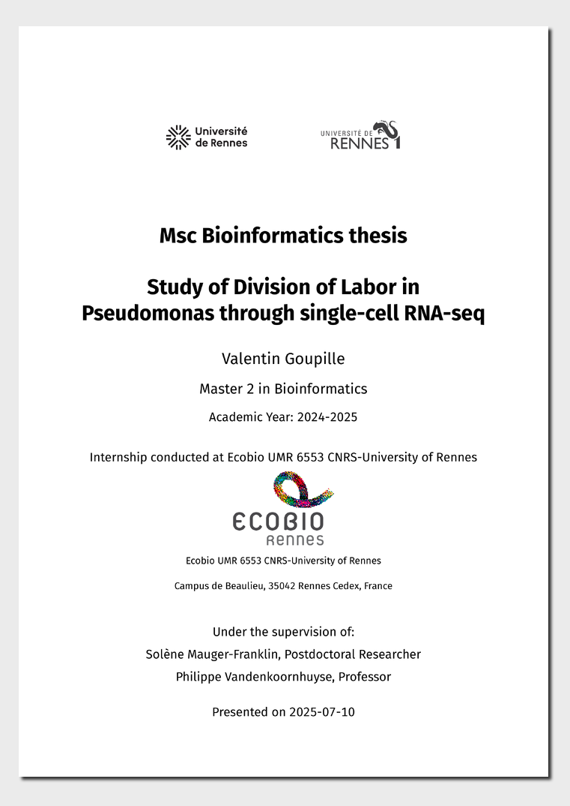

<!-- README.md is generated from README.qmd. Please edit that file -->

``` r
# Copy all .py files to docs/
# Using R's file system functions
py_files <- list.files(pattern = "\\.py$", recursive = TRUE)
if (length(py_files) > 0) {
  file.copy(py_files, "docs/", overwrite = TRUE)
  message("✅ Fichiers .py copiés dans docs/")
} else {
  message("Aucun fichier .py trouvé")
}
```

    ✅ Fichiers .py copiés dans docs/

# University of Rennes Msc Thesis Template

This is a Quarto template that assists you in creating a University of
Rennes Msc Thesis.

## Installation

You can create a thesis based on this template with the following
command:

``` bash
quarto use template quarto-vgoupille/Rapport_stage
```

This will install the extension and create the files that you can use as
a starting place for your thesis.

[](examples/template.pdf)
